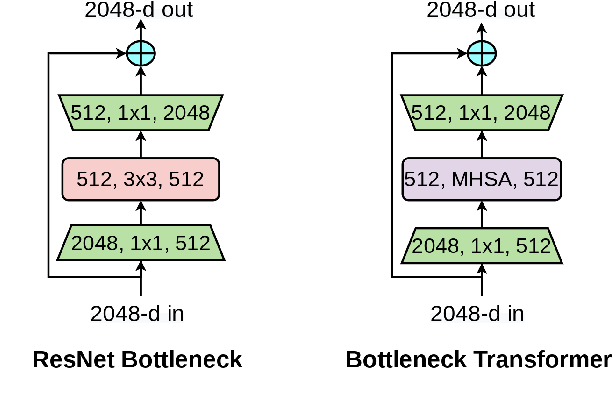

# BottleneckTransformers
  BoTNet is a conceptually simple yet powerful backbone architecture that incorporates self-attention for multiple computer vision tasks including image classification, object detection and instance segmentation. By just replacing the spatial convolutions with global self-attention in the final three bottleneck blocks of a ResNet and no other changes, our approach improves upon the baselines significantly on instance segmentation and object detection while also reducing the parameters, with minimal overhead in latency.
## Architecture

## Reference
 - [Paper link](https://arxiv.org/abs/2101.11605)
